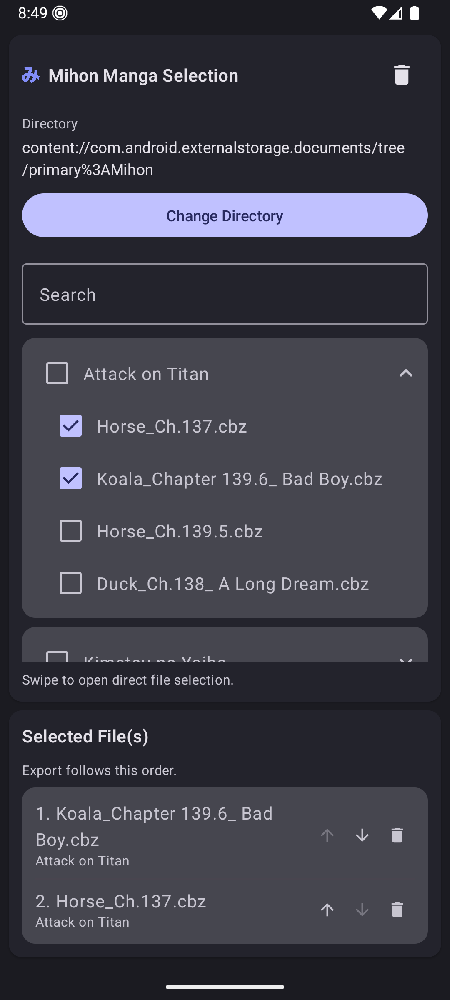
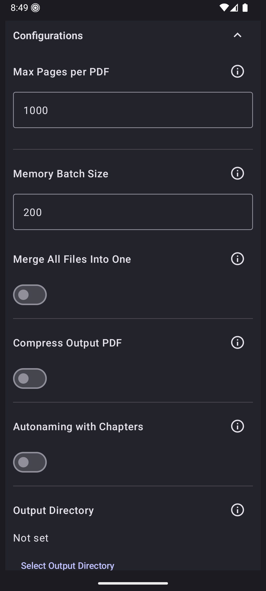
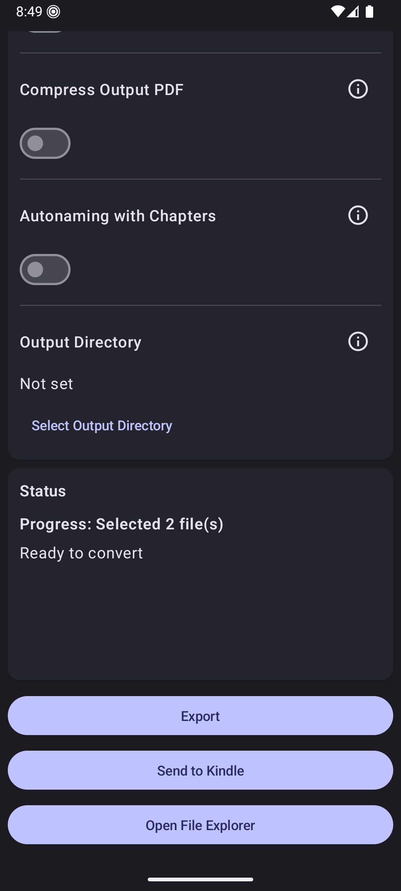

  

<h1 align="center">CBZConverter</h1>

CBZConverter lets you convert `.cbz` manga archives into `.pdf` files directly on your Android device.

---

## Features
- Convert one or many CBZ files in a single run.
- Merge multiple archives into a single PDF, even across different series, with clear warnings when mixing sources.
- Keep large series organized with sorting, custom output names, and optional chapter-aware auto naming.
- Control memory usage with configurable batch sizes and page limits that automatically split huge books into parts.
- Browse files manually or load your Mihon downloads for quick checkbox selection.
- Optional PDF compression plus the ability to pick a custom output directory.

---

## Previews

  
  
  

---

## Support the Creator
If you enjoy the app and want to help future development, consider supporting:

  
  

